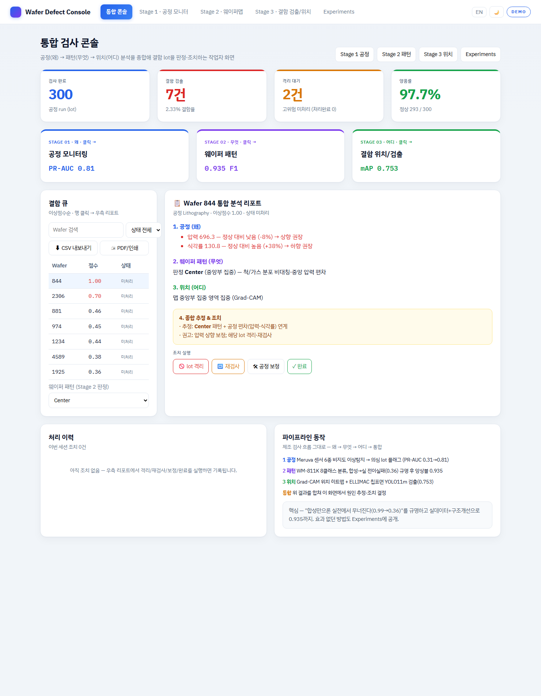
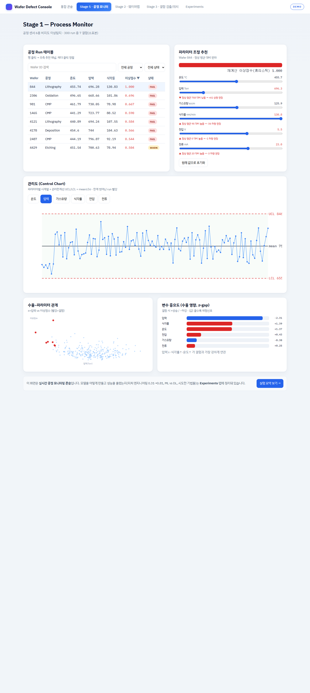
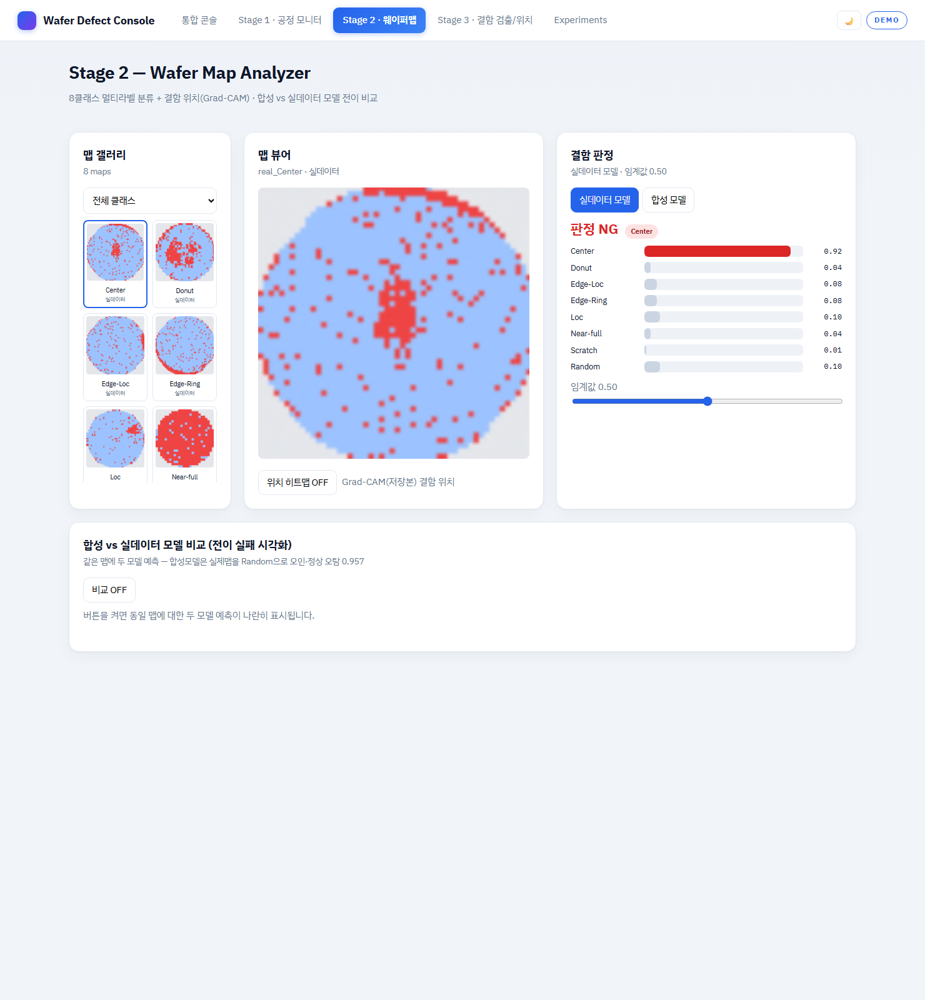
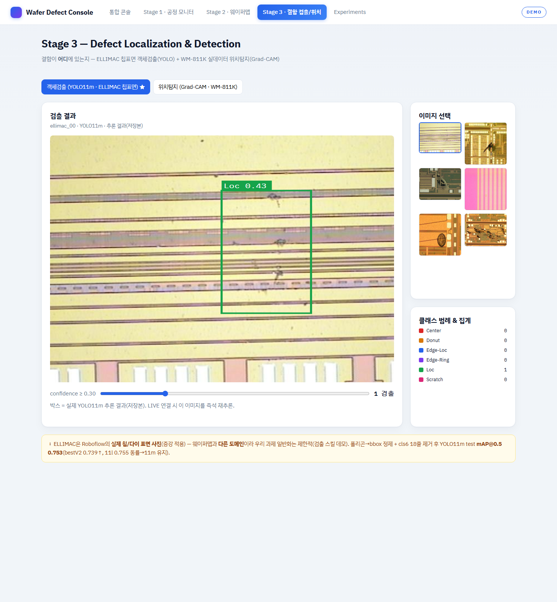
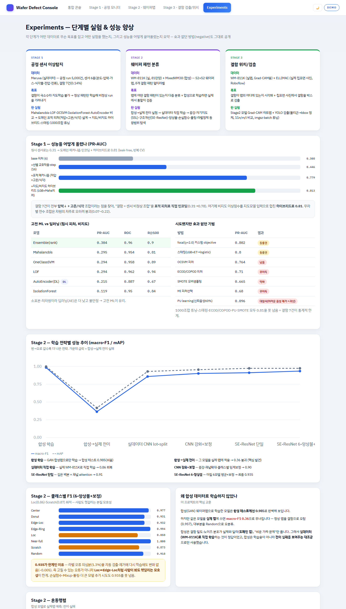

# wafer-defect-suite

### 🔗 라이브 데모: **[maxwell779.github.io/wafer-defect-suite](https://maxwell779.github.io/wafer-defect-suite/)**
> 통합 검사 콘솔(대시보드+의사결정) · Stage1 공정 · Stage2 웨이퍼맵 · Stage3 검출 · Experiments. 정적 DEMO 모드(모델 불필요), 다크모드 지원.

반도체 웨이퍼 결함을 **팹 검사 흐름(공정 → 웨이퍼 패턴 → 결함 위치)** 3단계로 분석하는 end-to-end 포트폴리오.
세 가지 모달리티(테이블 · 이미지맵 · 검출)에 각각 다른 ML 기법을 적용하고, **정직한 평가(leak-free · per-class · 불균형)** 로 검증한다.

> **핵심 서사**: 합성 데이터만으로 학습하면 실제에서 무너진다(0.99→0.36). 이를 정량·인과로 규명하고,
> **실데이터 학습 + 구조적 개선(SE-ResNet 앙상블)으로 0.935까지** 끌어올린다. 단순 튜닝·자기지도·전이는 효과 없음을 정직하게 보고한다.

📄 **결과 한눈에 보기: [docs/RESULTS.md](docs/RESULTS.md)** — 단계별 성능 향상 여정·천장 규명·핵심 교훈 종합

---

## 3-스테이지 결과 요약

| 스테이지 | 질문 | 데이터 | 기법 | 핵심 결과 |
|---|---|---|---|---|
| **1. 공정** | 왜 생기나 | Meruva (실, 결함 7/5000) | ML vs DL 이상탐지 + 피처eng + 지도/비지도 하이브리드 | 표적 교호작용으로 PR-AUC **0.31→0.81**(reps40 CI, 비지도 Maha 최강). 500조합·스태킹·PU 등 신규기법 천장 못넘음 규명 |
| **2. 웨이퍼 패턴** ★ | 어떤 패턴 | MixedWM38(합성)+WM-811K(실) | 멀티라벨 분류·전이·SE-ResNet | 합성 0.985 → **전이 0.364** → SE-ResNet 6앙상블 **0.935**(macro-F1) |
| **3. 결함 위치** | 어디 | WM-811K(실) / ELLIMAC(실사진) | Grad-CAM(메인) + YOLO(부록) | 실데이터 위치탐지 / ELLIMAC YOLO11m mAP@0.5 **0.753**(11l 무이득) |

---

## 데모 웹 화면

**통합 검사 콘솔** (대시보드 + 통합 리포트 + 의사결정) — 결함 큐·원인 리포트·격리/재검사 조치


**Stage 1 공정 모니터** (관리도·이상점수·파라미터 추천) / **Stage 2 웨이퍼맵** (판정·Grad-CAM)
<p>
 
</p>

**Stage 3 결함 검출** (ELLIMAC 칩표면 YOLO11m, 실제 추론 박스) / **Experiments** (단계별 성능 향상·전이실패 규명)
<p>
 
</p>

```bash
cd web && npm install && npm run dev      # http://localhost:5173 (정적 데모)
python -m backend.prep_samples && uvicorn backend.main:app --port 8000   # LIVE 추론(선택)
```

---

## Stage 1 — 공정 센서 이상탐지 (ML vs DL)
결함 7/5000(0.14%) → 지도분류 불가 → 정상만 학습하는 이상탐지. leak-free(정상 80% 학습).
양성 7건이라 단일 split은 노이즈가 커서 **30회 반복 CV(mean±std)** 로 평가.

| 모델 | PR-AUC (30-seed) | ROC-AUC | recall@100 |
|---|---|---|---|
| **Mahalanobis (ML)** | **0.295 ± 0.028** | 0.954 | 0.81 |
| OneClassSVM (ML) | 0.294 ± 0.030 | 0.958 | 0.89 |
| LOF (ML) | 0.294 ± 0.039 | 0.962 | **0.94** |
| AutoEncoder (DL) | 0.215 ± **0.095** | 0.887 | 0.67 |
| IsolationForest (ML) | 0.119 ± 0.055 | 0.950 | 0.84 |

→ **고전 ML 3종 통계적 동률(~0.295), DL은 더 낮고 분산 큼(±0.095, 불안정).** 소표본·저차원 테이블엔 DL 불필요.

**★ 피처 엔지니어링 (데이터셋 메커니즘 = "센서 비정상 조합"에 정합):**

| 피처셋 / 방법 (reps=30~40 CI) | 최고 모델 | PR-AUC |
|---|---|---|
| base (6) | kNN | 0.308 |
| +선별 교호작용·step (16) | Mahalanobis | 0.446 |
| +표적(저압×고온/식각) — 비지도 | **Mahalanobis** | **0.779** (±0.06, 안정) |
| +표적, 지도 GBM 전수 | LightGBM | 0.774 |
| +표적, 비지도 Maha 피처(reps40) | LightGBM | **0.813** ±0.31 (CI±.043) |
| +표적, focal(γ=2.0) 커스텀 objective | LightGBM | 0.802 |
| +표적, 스태킹(LGB+ET→logistic)+Maha | Stacking | 0.800 |
| ECOD/COPOD·SMOTE·MI·PU (신규 탐색) | — | 0.10~0.73 (무이득) |
| 전수 쌍조합 (36~41) | (붕괴) | 0.07~0.22 |

→ 결함=다변량 조합이라 **공분산 모델(Mahalanobis/GMM)이 최적, IForest(축정렬) 최악**. **선별 교호작용**으로 0.30→**0.45→0.78**.
→ **정직한 천장 규명(reps=40 CI)**: 500조합 그리드·스태킹·focal·ECOD/COPOD·PU·SMOTE·MI 전부 **~0.80–0.81을 못 넘음**. 비지도 Maha 피처가 여전히 최강 신호(0.813). **양성 7건이라 표준편차 ±0.31이 압도** = 통계적 천장의 정량 증거(단일 측정의 0.84+는 분산). PU 프레이밍 0.096(어려운 음성 제거→과신)·ECOD/COPOD 0.71은 정직한 negative. 배포엔 안정적 비지도 Maha 권장. _(상세: `docs/overnight/SUMMARY.md`)_
위험신호: pressure↓(z −2.31)·etch_rate↑·temp↑.
`run.py`(단일) · `rigor.py`(30-seed CV·앙상블) · `sweep.py`(피처×모델 스윕)

## Stage 2 — 웨이퍼 패턴 (플래그십)
| 실험 | macro-F1 | mAP | 메시지 |
|---|---|---|---|
| 합성(MixedWM38) | 0.985 | 0.999 | 합성은 쉬움 |
| 합성→실제 전이 | **0.364** | 0.417 | **도메인 갭 규명**(정상 오탐 0.957) |
| A 증강 진단 | 0.311 | 0.413 | "노이즈 원인설" 기각(증강 무효) |
| 실데이터 lot-split (baseline) | 0.859 | 0.930 | 단일 |
| 실데이터 + 자기지도 | 0.869 | 0.928 | SSL +0.01 (효과 미미) |
| CNN 강화(증강+width64) +보정 | 0.902 ± 0.008 | 0.955 | 3-seed |
| SE-ResNet 단일 (깊이+SE attention) | 0.912 → 보정 0.928 | 0.974 | ★★ 돌파 |
| **SE-ResNet 6-앙상블(w48×3+w64×3)+보정** | **0.935** | — | ★ 최종 best |

- 핵심: **구조적 변화(깊이+SE attention)+앙상블** 이 결정적(0.86→**0.935**). Loc 0.72→0.86, Scratch 0.78→0.87, Near-full→1.0
- per-class(6앙상블+보정): Edge-Ring 0.994 / NF 1.0 / Center 0.98 / Edge-Loc·Donut 0.93 / Random 0.92 / Scratch 0.87 / Loc 0.86
- (negative, 정직) 입력 패딩·해상도↑·class-balanced·**SimCLR·MAE·DINOv2·TTA** 모두 효과 없음 → "구조 > 단순튜닝" 입증
- **★ 천장의 정체 규명(cleanlab)**: 오라벨 1.3%(Loc 최다 121개) 제거해도 Δ-0.005 → 천장은 **고칠 수 있는 노이즈가 아니라 Loc↔Edge-Loc/Center 본질 모호성**. 추가 손실(tversky/ldam/smoothbce)·mixup/cutmix·GeM/maxavg 풀링·ViT·dilated·width96 전부 0.935 못넘음(단일 best=lr2e-3+GeM 0.913). _(상세: `docs/overnight/SUMMARY.md`)_
- 평가: **lot 그룹 분할**(누수 차단), 다중 seed, 임계 val-only
- `train_real --augment --width 64 --loss asl` · `rigor`(임계보정·혼동) · `transfer_eval` · `ssl_pretrain`

## Stage 3 — 결함 위치
- **B(메인, 실데이터)**: Stage2 실모델 **Grad-CAM** → WM-811K 실제 맵의 결함 위치 히트맵 (합성 무관)
  `python -m src.stage3_localization.gradcam`
- **A(부록, 합성)**: ELLIMAC 폴리곤→bbox 정제 + cls6 제거 → **YOLO11m mAP@0.5 0.753**(채택, bestV2 0.739↑). YOLO11l 0.755 ≈ 동률(더 큰 모델 무이득) → **11m 유지(효율)**. 검출도 ~0.75 천장.
  `python -m src.stage3_detection.benchmark`

---

## 데모 웹 (`web/`)
React(Vite) 단일앱. 5화면 모두 실제 기능:
Dashboard · Stage1(테이블·관리도·파라미터 추천·ML vs DL) · Stage2(갤러리·판정·Grad-CAM 히트맵·합성vs실데이터 토글) · Stage3(Grad-CAM 위치탐지 + ELLIMAC 검출) · Experiments(추이·per-class·혼동행렬).
```bash
cd web && npm install && npm run dev   # http://localhost:5173
```
**LIVE 추론(선택)** — FastAPI 백엔드 연결 시 실제 모델 추론:
```bash
python -m backend.prep_samples            # 최초 1회
uvicorn backend.main:app --port 8000      # 백엔드
```
웹이 백엔드를 감지하면 상단 배지가 **LIVE**로 바뀌고, Stage1 슬라이더→실시간 LOF 점수,
Stage2 "⚡LIVE 추론"→실제 WaferCNN 예측(실모델 vs 합성모델 전이 실패를 실시간으로). 백엔드 없으면 정적 데모로 폴백.

## 배포

**① 정적 데모 (GitHub Pages)** — 모델 불필요, DEMO 모드 공개 URL
`.github/workflows/deploy-pages.yml` 이 main push마다 빌드→배포. 저장소 **Settings → Pages → Source: GitHub Actions** 한 번 설정 후:
`https://maxwell779.github.io/wafer-defect-suite/`

**② Docker (LIVE 추론, 어디서나 한 방)** — 프론트+FastAPI 단일 컨테이너
```bash
docker compose up --build           # → http://localhost:8000 (DEMO)
# LIVE 추론(가중치)은 compose의 volumes(experiments/·data/) 주석 해제 후 재실행
```
- CI: `.github/workflows/ci.yml` (web 빌드 + 백엔드 문법 체크)
- 정적 호스트(Pages)는 백엔드가 없어 자동 DEMO 폴백, Docker/로컬은 같은 오리진 `/api` 로 LIVE.

## 구조
```
src/stage1_process/   공정 이상탐지(ML vs DL)
src/stage2_wafermap/  데이터셋·모델·학습(합성/실데이터)·전이·자기지도·Grad-CAM은 stage3로
src/stage3_localization/  Grad-CAM 위치탐지(실)   src/stage3_detection/  ELLIMAC YOLO(합성)
src/common/           metrics(멀티라벨)·seed
backend/              FastAPI 추론 서버(+ 빌드된 web 정적 서빙)
tools/overnight/      대규모 자동 실험 오케스트레이터(CPU∥GPU) · Stage1 메가서치
web/                  React 데모 콘솔(Vite)
docs/                 PRD · RESULTS(결과 종합) · overnight/SUMMARY · images(스크린샷)
notebooks/            EDA 노트
Dockerfile · docker-compose.yml · .github/workflows/   배포·CI
data/ , experiments/  데이터·산출물 (git 제외)
```

## 데이터 & 출처
데이터는 레포에 미포함(`.gitignore`). 아래 출처에서 받아 `data/` 에 둔다. 연구·포트폴리오 목적.

| 데이터셋 | 내용 | 출처 |
|---|---|---|
| **WM-811K** | 실제 웨이퍼맵 811k (LSWMD) | [Kaggle: qingyi/wm811k-wafer-map](https://www.kaggle.com/datasets/qingyi/wm811k-wafer-map) · [이미지판](https://www.kaggle.com/datasets/muhammedjunayed/wm811k-silicon-wafer-map-dataset-image) (MIR Lab / Wu et al. 2015) |
| **MixedWM38** | 합성 멀티라벨 웨이퍼맵 38k | [Kaggle: co1d7era/mixedtype-wafer-defect-datasets](https://www.kaggle.com/datasets/co1d7era/mixedtype-wafer-defect-datasets) (Wang et al.) |
| **ELLIMAC** | 실제 칩/다이 표면 결함 사진 + 검출 라벨 | [Kaggle: ellimaaac/wafer-defects-images-annotations-model](https://www.kaggle.com/datasets/ellimaaac/wafer-defects-images-annotations-model) · [Roboflow](https://universe.roboflow.com/wafer-irhuv/wafer-defect-rv1vx) |
| **Meruva** | 공정 센서 테이블(결함 7/5000) | [Kaggle: meruvakodandasuraj/semiconductor-wafer-defect-classification-dataset](https://www.kaggle.com/datasets/meruvakodandasuraj/semiconductor-wafer-defect-classification-dataset) |

> ELLIMAC은 **실제 칩표면 사진**(Roboflow 증강)이며 웨이퍼맵과 도메인이 달라 검출 스킬 데모로 활용. MixedWM38(합성)은 학습이 아니라 "합성→실 전이 실패"를 보이는 대조군으로만 사용.

## 평가 원칙
leak-free(lot 그룹 분할, seed 고정, 임계 val-only) · per-class·불균형(macro-F1·mAP·PR-AUC) · **정직성**(전이 실패·negative result 그대로 보고).
